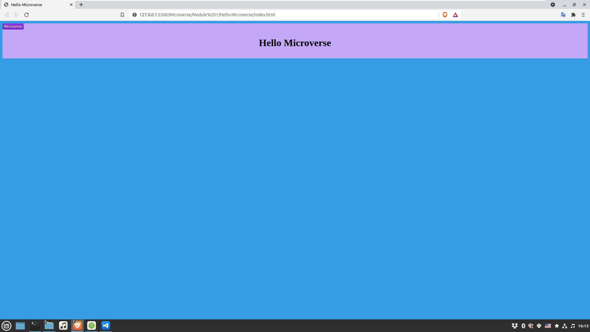

# Hello Microverse

> This is the first project from Module 1 in Microverse HTML & CSS class. The basic purpose is to follow the GitHub Flow practice, set up linters and use the professional looking template for README.md file.

Here are the main requirements for the project.

- Remember to document your work in a professional way.
- Create a new GitHub repo.
- Create a new branch according to the GitHub flow rules.
- Add a .gitignore file.
- Set up a linter for HTML and CSS and make sure that any files that are not relevant are ignored by git.
- Add descriptive README file to your project - please use this template but remember to customize it to your project.
- Add 3 files (each one in a separate commit):

## Built With

- Major languages: HTMLC, CSS
- Frameworks: none 
- Technologies used: Git

## Live Demo

[Live Demo Link](https://hombre2014.github.io/Hello-Microverse/)

## Getting Started

**Simply open the link above.**

To get a local copy up and running follow these simple example steps.

### Prerequisites

- Internet connection and browser

### Setup

### Install

### Usage

### Run tests

### Deployment

## Author

👤 **Yuriy Chamkoriyski**

- GitHub: [@Hombre2014](https://github.com/Hombre2014)
- Twitter: [@Chamkoriyski](https://twitter.com/Chamkoriyski)
- LinkedIn: [axebit](https://linkedin.com/in/axebit)

## 🤝 Contributing

Contributions, issues, and feature requests are welcome!

Feel free to check the [issues page](https://github.com/Hombre2014/Hello-Microverse/issues).

## Show your support

Give a ⭐️ if you like this project!

## Acknowledgments

- Thanks to [@BonkeGcobo](https://github.com/BonkeGcobo) for helping setting up linters

## 📝 License

This project is [MIT](./MIT.md) licensed.
